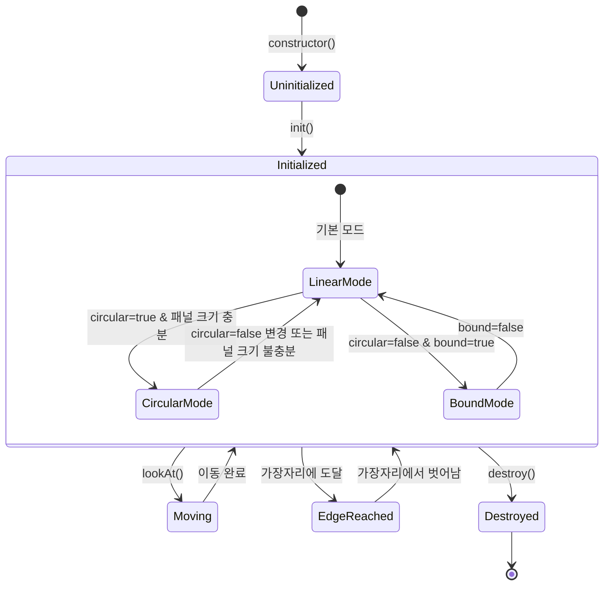

# Camera StateChart

## Overview

Camera는 Flicking에서 뷰포트 내 실제 움직임을 담당하는 컴포넌트입니다. 패널들의 위치, 보이는 범위, 순환 모드 및 위치 계산 등 시각적인 부분을 처리합니다.

## States

Camera 컴포넌트는 다음과 같은 주요 상태를 가집니다:

1. **Uninitialized**: 생성되었지만 초기화되지 않은 상태
2. **Initialized**: 초기화된 상태
3. **Moving**: 이동 중인 상태
4. **EdgeReached**: 가장자리에 도달한 상태
5. **Destroyed**: 파괴된 상태

## Modes

Camera는 다양한 모드에 따라 동작이 달라집니다:

1. **LinearCameraMode**: 기본 모드, 패널이 첫 번째부터 마지막까지 순차적으로 배치
2. **CircularCameraMode**: 순환 모드, 첫 번째와 마지막 패널이 연결되어 무한 스크롤 가능
3. **BoundCameraMode**: 경계 모드, 뷰포트가 패널 범위를 벗어나지 못하도록 제한

## State Transitions

## Events

Camera 자체는 이벤트를 발생시키지 않지만, 다음 Flicking 이벤트에 관여합니다:

- `NEED_PANEL`: 더 많은 패널이 필요할 때 발생
- `VISIBLE_CHANGE`: 보이는 패널이 변경될 때 발생
- `REACH_EDGE`: 가장자리에 도달했을 때 발생

## Properties

Camera의 주요 속성:

| 속성 | 타입 | 설명 |
|------|------|------|
| element | HTMLElement | 카메라 엘리먼트(`.flicking-camera`) |
| position | number | 카메라의 현재 위치 |
| alignPosition | number | 패널 정렬 기준 위치 |
| visiblePanels | Panel[] | 현재 보이는 패널 배열 |
| circularEnabled | boolean | 순환 모드 활성화 여부 |
| range | {min: number, max: number} | 카메라가 도달 가능한 위치 범위 |
| mode | CameraMode | 현재 카메라 모드 |
| progress | number | 첫 패널부터 마지막 패널까지의 진행도 |

## Methods

카메라의 주요 메서드:

| 메서드 | 파라미터 | 설명 |
|--------|----------|------|
| init | - | 카메라 초기화 |
| destroy | - | 카메라 파괴 |
| lookAt | position: number | 특정 위치로 카메라 이동 |
| updateRange | - | 카메라 이동 범위 업데이트 |
| updateAlignPos | - | 정렬 위치 업데이트 |
| updateAnchors | - | 앵커 포인트 업데이트 |
| findNearestAnchor | position: number | 특정 위치에서 가장 가까운 앵커 찾기 |
| canReach | panel: Panel | 패널에 도달 가능한지 확인 |
| canSee | panel: Panel | 패널이 보이는지 확인 |

## 카메라 동작 시나리오

1. **초기화**: Flicking 초기화 시 Camera 객체가 생성되고 초기화됩니다.
2. **모드 설정**: 
   - `circular` 옵션이 활성화되고 패널 크기가 충분하면 CircularCameraMode로 설정
   - `bound` 옵션이 활성화되면 BoundCameraMode로 설정
   - 그 외의 경우 LinearCameraMode로 설정
3. **위치 계산**: 
   - 뷰포트 크기와 align 옵션을 기반으로 alignPosition 계산
   - 패널 크기와 위치를 기반으로 anchorPoints 계산
   - 카메라의 이동 가능 범위(range) 계산
4. **패널 가시성 관리**:
   - 현재 위치에서 보이는 패널 목록 업데이트
   - 필요한 경우 새 패널 요청 이벤트 발생
   - 패널 가시성 변경 시 이벤트 발생
5. **가장자리 감지**: 
   - 카메라가 이동 가능한 범위의 끝에 도달하면 이벤트 발생
   - 순환 모드에서는 패널 순서 재정렬

## Camera와 다른 컴포넌트 간의 관계

- **Flicking**: Camera를 생성하고 관리
- **Viewport**: 카메라가 움직이는 컨테이너 역할
- **Panel**: 카메라가 보여주는 패널들
- **Control**: 카메라 위치를 사용자 입력에 따라 변경
- **CameraMode**: 카메라의 동작 방식 결정

## 구현 고려사항

1. **순환 모드 활성화 조건**: 패널의 총 크기가 뷰포트 크기보다 충분히 커야 함
2. **앵커 포인트**: 각 패널의 alignPosition을 기준으로 결정되는 카메라 정지 지점
3. **변환 효율성**: 하드웨어 가속을 위한 최적의 CSS 변환 속성 선택(transform)
4. **패널 가시성 계산**: 현재 카메라 위치에서 보이는 패널을 효율적으로 계산 