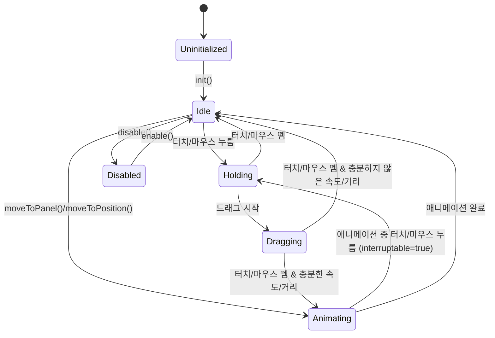

# Control StateChart

## Overview

Control은 Flicking에서 사용자 입력과 애니메이션을 관리하는 컴포넌트입니다. 마우스/터치 이벤트를 처리하고, 패널 간 이동 애니메이션을 제어하며, 현재 활성화된 패널 관리를 담당합니다.

## 컴포넌트 구조

Control은 추상 클래스로, 세 가지 구현 클래스가 있습니다:

1. **SnapControl**: 패널에 스냅되는 움직임 제공 (기본)
2. **FreeControl**: 자유로운 스크롤 움직임 제공
3. **StrictControl**: 한 번에 한 패널씩만 이동 가능한 엄격한 제어

## States

Control 컴포넌트는 내부에 StateMachine을 사용하여 다음과 같은 상태를 관리합니다:

1. **Idle**: 사용자 입력 대기 상태
2. **Holding**: 사용자가 화면을 누르고 있는 상태
3. **Dragging**: 사용자가 드래그하는 상태
4. **Animating**: 애니메이션 실행 중인 상태
5. **Disabled**: 사용자 입력이 비활성화된 상태

## State Transitions

## 상태별 동작

### Idle 상태
- 사용자 입력 대기
- 패널 선택 이벤트 발생 가능
- activePanel 관리

### Holding 상태
- 사용자가 터치/마우스를 누른 상태
- 드래그 시작을 위한 준비
- 움직임 방향 계산

### Dragging 상태
- 사용자가 드래그하는 상태
- 카메라 위치 실시간 업데이트
- 드래그 속도 계산

### Animating 상태
- 자동 애니메이션 중인 상태
- 목표 위치로 부드럽게 이동
- 애니메이션 중단 가능 여부(interruptable) 관리

### Disabled 상태
- 사용자 입력 비활성화 상태
- 모든 입력 이벤트 무시
- 애니메이션은 여전히 가능

## Events

Control 컴포넌트는 다음과 같은 Flicking 이벤트에 관여합니다:

- `HOLD_START`: 사용자가 화면을 누를 때 발생
- `HOLD_END`: 사용자가 화면에서 손을 뗄 때 발생
- `MOVE_START`: 패널 이동 시작 시 발생
- `MOVE`: 패널 이동 중 발생
- `MOVE_END`: 패널 이동 종료 시 발생
- `WILL_CHANGE`: 현재 패널이 변경될 예정일 때 발생
- `CHANGED`: 현재 패널이 변경되었을 때 발생
- `WILL_RESTORE`: 현재 패널로 돌아갈 예정일 때 발생
- `RESTORED`: 현재 패널로 돌아왔을 때 발생

## Properties

Control의 주요 속성:

| 속성 | 타입 | 설명 |
|------|------|------|
| controller | AxesController | @egjs/axes를 관리하는 컨트롤러 |
| activeIndex | number | 현재 활성화된 패널의 인덱스 |
| activePanel | Panel \| null | 현재 활성화된 패널 |
| animating | boolean | 애니메이션 중인지 여부 |
| holding | boolean | 사용자가 화면을 누르고 있는지 여부 |

## Methods

Control의 주요 메서드:

| 메서드 | 파라미터 | 설명 |
|--------|----------|------|
| init | flicking: Flicking | Control 초기화 |
| destroy | - | Control 파괴 |
| enable | - | 사용자 입력 활성화 |
| disable | - | 사용자 입력 비활성화 |
| moveToPanel | panel: Panel, options | 특정 패널로 이동 |
| moveToPosition | position: number, duration: number | 특정 위치로 이동 |
| updateAnimation | panel: Panel, duration?: number | 애니메이션 업데이트 |
| stopAnimation | - | 애니메이션 중단 |
| updatePosition | progressInPanel: number | 리사이징 후 위치 업데이트 |
| updateInput | - | 입력 상태 업데이트 |

## 제어 전략별 차이점

### SnapControl
- 패널 간 이동 시 항상 특정 패널에 스냅됨
- threshold 값에 따라 다음/이전 패널로 이동 결정
- 가속도에 따른 멀티 패널 점프 지원

### FreeControl
- 자유로운 스크롤 동작
- 패널에 스냅되지 않고 어떤 위치에서든 멈출 수 있음
- 스크롤 종료 시 관련 패널이 활성화됨

### StrictControl
- 한 번에 한 패널만 이동 가능
- 드래그 중에도 현재 또는 인접 패널에만 위치 가능
- 가장 제한적인 움직임 제공

## Control과 다른 컴포넌트 간의 관계

- **Flicking**: Control을 생성하고 관리
- **Camera**: Control은 Camera의 위치를 변경
- **Panel**: Control이 패널 간 이동을 관리
- **AxesController**: 실제 입력 및 애니메이션 처리를 담당

## 구현 고려사항

1. **상태 관리**: StateMachine 패턴을 사용하여 복잡한 입력 및 애니메이션 상태 처리
2. **입력 처리**: 다양한 입력 장치(마우스, 터치) 지원
3. **애니메이션 최적화**: 부드러운 패널 전환을 위한 애니메이션 처리
4. **경계 조건 처리**: 첫/마지막 패널에서의 특수 동작(바운스, 순환 등) 관리 