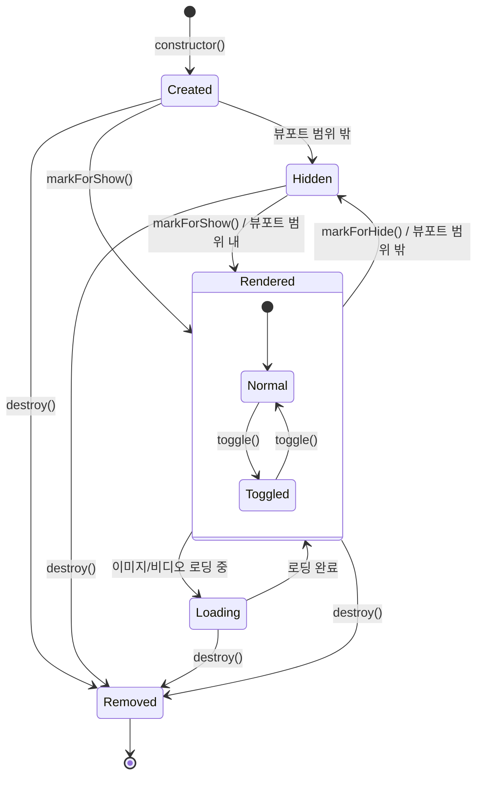
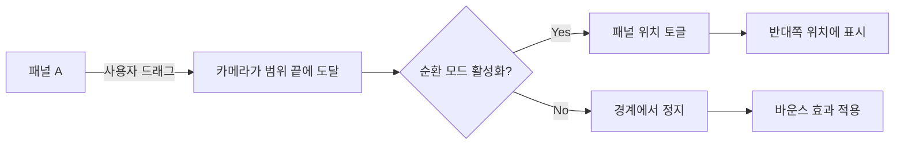

# Panel StateChart

## Overview

Panel은 Flicking에서 개별 슬라이드를 나타내는 컴포넌트입니다. 각 Panel은 DOM 요소에 대한 참조를 유지하면서 위치, 크기, 가시성 등의 상태를 관리합니다. Panel은 Renderer에 의해 생성되고 Camera에 의해 시각적으로 표시됩니다.

## States

Panel 컴포넌트는 다음과 같은 상태를 가집니다:

1. **Created**: 패널이 생성된 초기 상태
2. **Rendered**: 패널이 화면에 렌더링된 상태
3. **Hidden**: 패널이 화면에서 숨겨진 상태
4. **Loading**: 패널 내부 콘텐츠(이미지/비디오)가 로딩 중인 상태
5. **Toggled**: 순환(circular) 모드에서 패널 위치가 토글된 상태
6. **Removed**: 패널이 제거된 상태

## State Transitions

## Properties

Panel의 주요 속성:

| 속성 | 타입 | 설명 |
|------|------|------|
| element | HTMLElement | 패널이 참조하는 DOM 요소 |
| index | number | 패널의 인덱스 |
| position | number | alignPosition을 포함한 패널의 현재 위치 |
| size | number | 패널 요소의 캐시된 크기 |
| sizeIncludingMargin | number | CSS margin을 포함한 패널의 크기 |
| height | number | 패널 요소의 높이 |
| margin | object | 패널 요소의 CSS margin 값 |
| alignPosition | number | 패널 내 정렬 기준 위치 |
| removed | boolean | 패널이 제거되었는지 여부 |
| rendered | boolean | 패널이 화면에 렌더링되고 있는지 여부 |
| loading | boolean | 패널 내부 콘텐츠가 로딩 중인지 여부 |
| toggled | boolean | 순환 모드에서 패널 위치가 토글되었는지 여부 |
| offset | number | 패널 위치의 실제 오프셋 |
| progress | number | 이 패널로부터의 이동 진행률 |
| visibleRatio | number | 패널이 뷰포트에 보이는 비율 |

## Methods

Panel의 주요 메서드:

| 메서드 | 파라미터 | 설명 |
|--------|----------|------|
| markForShow | - | 패널을 표시 상태로 표시 |
| markForHide | - | 패널을 숨김 상태로 표시 |
| resize | cached?: object | 패널 크기 재계산 |
| setSize | size: object | 패널 크기 설정 |
| contains | element: HTMLElement | 특정 요소가 패널에 포함되는지 확인 |
| destroy | - | 패널 파괴 |
| includePosition | pos: number, includeMargin?: boolean | 특정 위치가 패널 범위에 포함되는지 확인 |
| isVisibleOnRange | min: number, max: number | 패널이 주어진 범위에서 보이는지 확인 |
| focus | duration?: number | 패널로 포커스 이동 |
| prev | - | 이전 패널 반환 |
| next | - | 다음 패널 반환 |
| toggle | prevPos: number, newPos: number | 패널 위치 토글 (순환 모드) |

## 패널 라이프사이클

1. **생성**: Renderer가 패널 객체 생성
2. **렌더링**: 패널이 화면에 보여지거나 숨겨짐
3. **크기 조정**: 패널 크기가 계산되고 업데이트됨
4. **위치 계산**: 패널 위치가 계산되고 업데이트됨
5. **순환 처리**: 순환 모드에서 필요에 따라 패널 위치 토글
6. **제거**: 패널이 Flicking에서 제거됨

## 패널 가시성 관리

### 일반 모드
1. 패널이 뷰포트 내에 있으면 `rendered = true`
2. 패널이 뷰포트 밖에 있으면 `rendered = false`

### 가상화 모드
1. 패널이 가상화 범위 내에 있으면 DOM 요소 생성 및 `rendered = true`
2. 패널이 가상화 범위 밖에 있으면 DOM 요소 재사용 또는 제거 및 `rendered = false`

### renderOnlyVisible 옵션 사용 시
1. 보이는 패널만 실제로 렌더링
2. 보이지 않는 패널은 DOM에 있지만 `visibility: hidden` 또는 `display: none` 처리

## 순환 모드에서의 패널 동작

1. **토글 조건**: 카메라가 특정 위치를 넘어갈 때 패널 위치 토글
2. **방향 계산**: 토글 방향(PREV/NEXT) 결정
3. **위치 업데이트**: 패널의 offset 값 업데이트하여 정해진 방향으로 이동

## 패널과 다른 컴포넌트 간의 관계

- **Renderer**: 패널을 생성하고 관리
- **Camera**: 패널의 위치와 가시성을 제어
- **Control**: 활성 패널로 이동하는 동작 수행
- **Viewport**: 패널이 보여지는 컨테이너 역할

## 패널 크기 처리

1. **기본 크기 계산**: 
   - 패널 요소의 offsetWidth/offsetHeight
   - CSS margin 계산
   - 내부 콘텐츠 크기 고려

2. **그리드 모드 크기 계산** (panelsPerView 옵션 사용 시):
   - 뷰포트 크기를 기준으로 균일한 크기 계산
   - CSS를 통한 강제 크기 적용

3. **적응형 높이** (adaptive 옵션 사용 시):
   - 현재 패널 높이에 맞게 뷰포트 높이 조정

## 구현 고려사항

1. **최적화**: 
   - 크기 및 위치 계산 캐싱
   - 불필요한 DOM 조작 최소화

2. **크기 계산 정확성**: 
   - 다양한 박스 모델(border-box, content-box) 지원
   - 소수점 크기 지원

3. **콘텐츠 로딩 처리**:
   - 이미지/비디오 로딩 이벤트 처리
   - 로딩 후 자동 리사이징 지원 