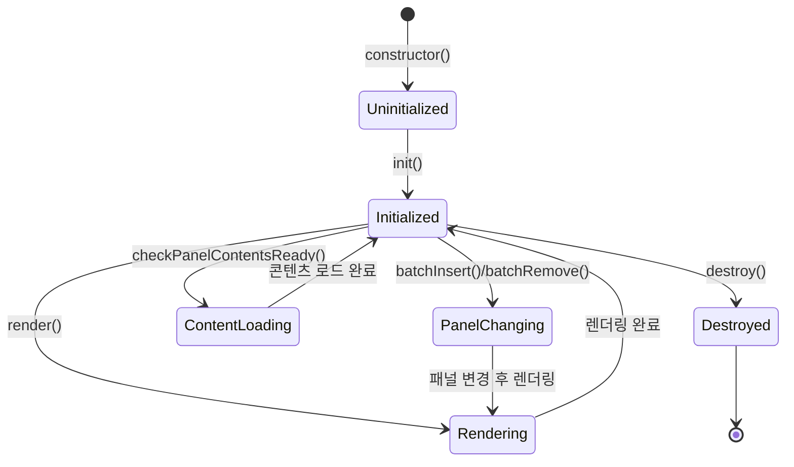
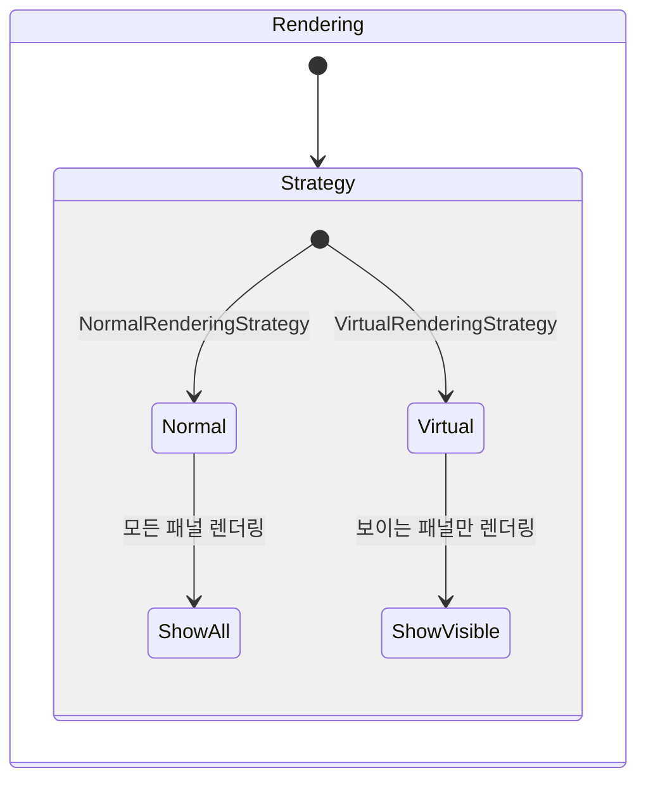

# Renderer StateChart

## Overview

Renderer는 Flicking에서 패널과 그 엘리먼트들을 관리하는 핵심 컴포넌트입니다. 패널의 생성, 삭제, 렌더링 및 크기 조정을 담당하며, 다양한 렌더링 전략을 지원합니다.

## 컴포넌트 구조

Renderer는 추상 클래스로, 두 가지 주요 구현 클래스가 있습니다:

1. **VanillaRenderer**: 기본 DOM 기반 렌더러
2. **ExternalRenderer**: 프레임워크(React, Vue 등)와 통합을 위한 렌더러

또한 렌더링 방식에 따라 두 가지 전략을 사용합니다:

1. **NormalRenderingStrategy**: 모든 패널을 일반적으로 렌더링
2. **VirtualRenderingStrategy**: 가상화된 패널을 관리하여 DOM 요소 수를 제한

## States

Renderer 컴포넌트는 다음과 같은 상태를 가집니다:

1. **Uninitialized**: 생성되었지만 초기화되지 않은 상태
2. **Initialized**: 초기화된 상태
3. **Rendering**: 패널 렌더링 중인 상태
4. **PanelChanging**: 패널 추가/제거 중인 상태
5. **ContentLoading**: 패널 내용(이미지/비디오) 로딩 중인 상태
6. **Destroyed**: 파괴된 상태

## State Transitions

## 렌더링 전략별 동작

## Events

Renderer 컴포넌트가 관여하는 Flicking 이벤트:

- `READY`: 모든 패널이 처음 렌더링된 후 발생
- `BEFORE_RESIZE`: 패널 크기 조정 전 발생
- `AFTER_RESIZE`: 패널 크기 조정 후 발생
- `PANEL_CHANGE`: 패널이 추가/제거될 때 발생

## Properties

Renderer의 주요 속성:

| 속성 | 타입 | 설명 |
|------|------|------|
| panels | Panel[] | 모든 패널 배열 |
| panelCount | number | 패널의 총 개수 |
| rendering | boolean | 현재 렌더링 중인지 여부 |
| strategy | RenderingStrategy | 현재 사용 중인 렌더링 전략 |
| align | ALIGN \| string \| number | 패널 정렬 방식 |

## Methods

Renderer의 주요 메서드:

| 메서드 | 파라미터 | 설명 |
|--------|----------|------|
| init | flicking: Flicking | 렌더러 초기화 |
| destroy | - | 렌더러 파괴 |
| render | - | 패널 렌더링 |
| getPanel | index: number | 특정 인덱스의 패널 반환 |
| updatePanelSize | - | 모든 패널 크기 업데이트 |
| batchInsert | items: object[] | 새 패널 일괄 추가 |
| batchRemove | items: object[] | 패널 일괄 제거 |
| checkPanelContentsReady | panels: Panel[] | 패널 내 콘텐츠 로드 확인 |

## 렌더링 시나리오

### 일반 렌더링 전략 (NormalRenderingStrategy)
1. 모든 패널 엘리먼트를 카메라 엘리먼트에 추가
2. 모든 패널에 대해 크기 계산 및 위치 설정
3. 옵션에 따라 보이는 패널만 표시할 경우, 현재 보이는 범위 외의 패널을 숨김

### 가상 렌더링 전략 (VirtualRenderingStrategy)
1. 실제 DOM에는 제한된 수의 패널 엘리먼트만 생성
2. 현재 보이는 영역과 그 주변 패널만 렌더링
3. 스크롤 시 패널 엘리먼트를 재사용하여 새로운 콘텐츠 표시

## 패널 관리 시나리오

### 패널 추가
1. 새 패널 객체 생성
2. 패널 배열에 추가 및 인덱스 업데이트
3. DOM 요소 추가 (필요한 경우)
4. 카메라 및 컨트롤 업데이트

### 패널 제거
1. 제거할 패널 선택
2. 패널 배열에서 제거 및 인덱스 업데이트
3. DOM 요소 제거 (필요한 경우)
4. 카메라 및 컨트롤 업데이트

## 크기 조정 처리

### 기본 패널 크기 조정
각 패널이 자체적으로 크기 계산

### 그리드 기반 크기 조정 (panelsPerView 옵션 사용 시)
1. 첫 번째 패널의 크기 계산
2. 뷰포트 크기를 기준으로 모든 패널에 동일한 크기 적용

## Renderer와 다른 컴포넌트 간의 관계

- **Flicking**: Renderer를 생성하고 관리
- **Camera**: Renderer가 생성한 패널을 Camera가 시각적으로 보여줌
- **Panel**: Renderer가 패널 객체를 생성하고 관리
- **Control**: 패널 변경 시 Control에 알려 활성 패널 업데이트

## 구현 고려사항

1. **성능 최적화**: 
   - renderOnlyVisible 옵션을 통한 불필요한 렌더링 방지
   - virtual 옵션을 통한 DOM 요소 수 제한

2. **프레임워크 통합**: 
   - 다양한 프레임워크(React, Vue 등)와의 호환성
   - 외부 렌더링 시스템 지원

3. **동적 패널 관리**:
   - 런타임에 패널 추가/제거 지원
   - 패널 변경 후 상태 동기화 