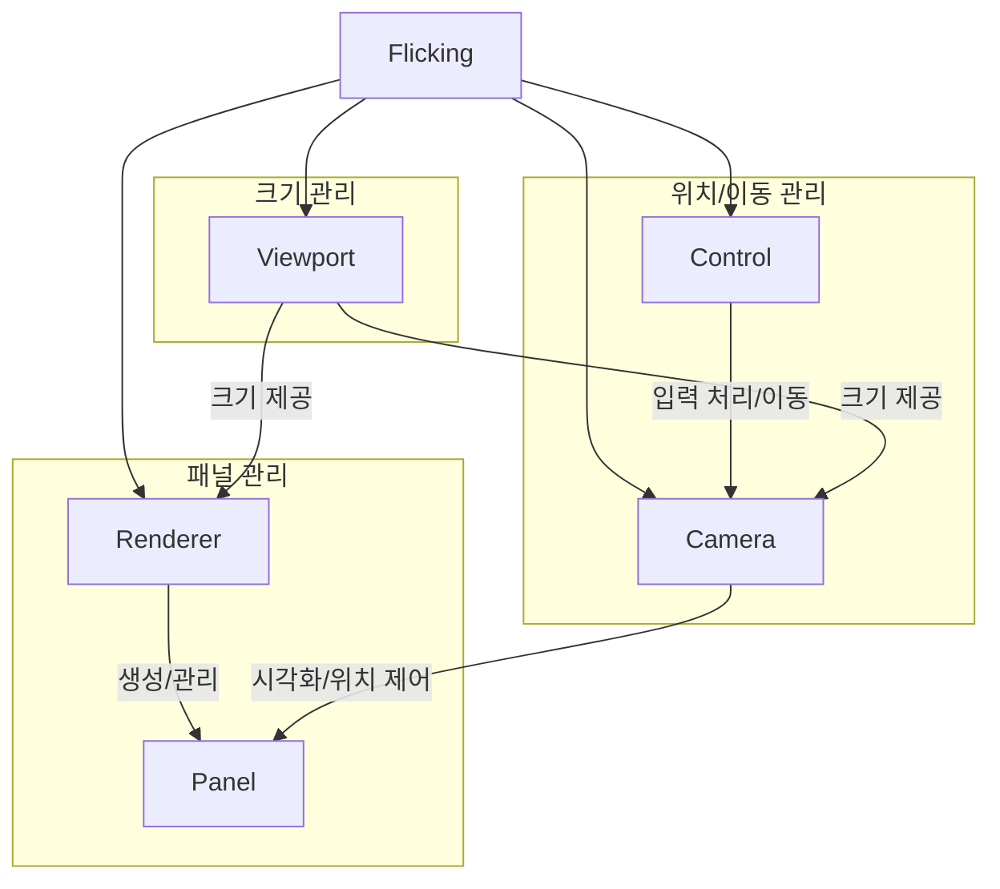
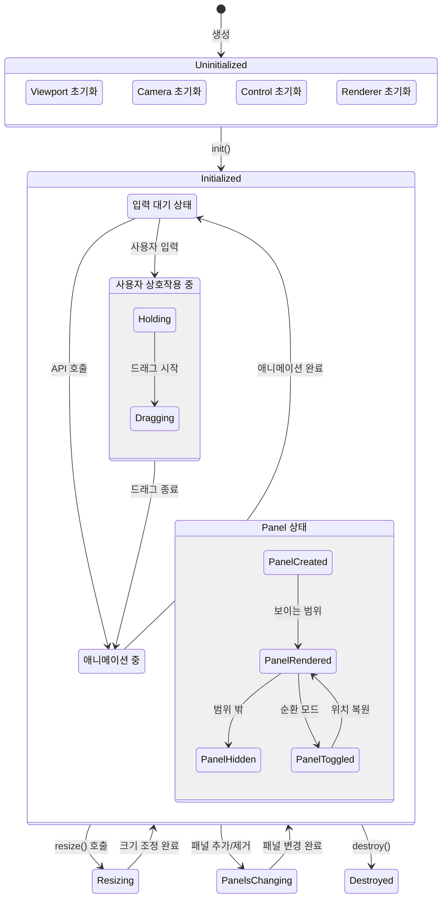
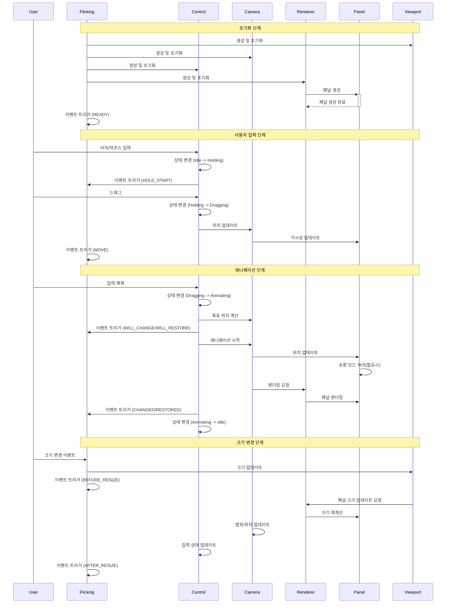
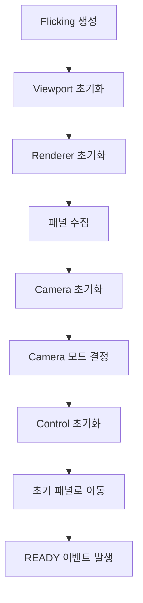
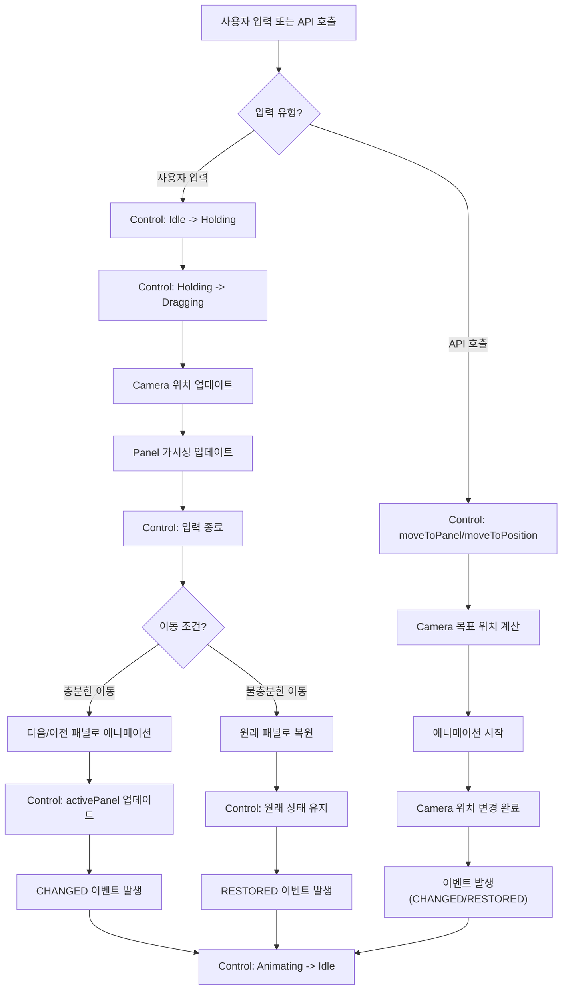
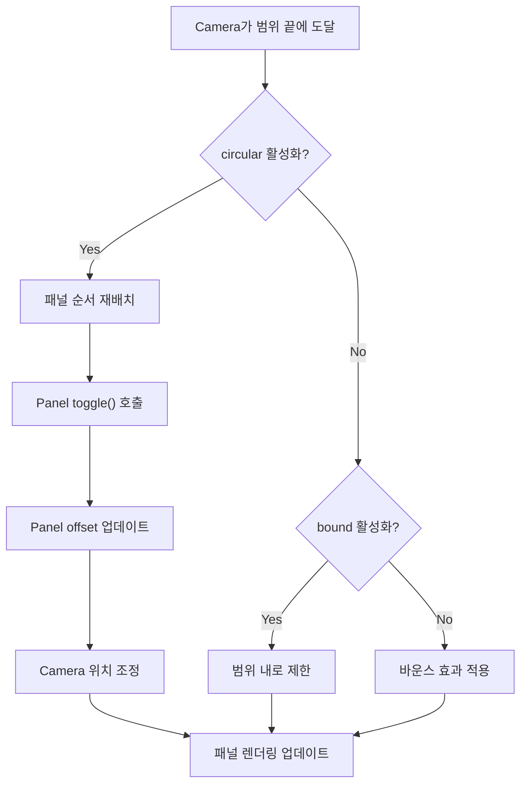

# Flicking 시스템 통합 StateChart

## 컴포넌트 개요

Flicking은 다음과 같은 핵심 컴포넌트로 구성됩니다:

1. **Viewport**: 패널이 보여지는 컨테이너 역할을 하며 크기를 관리
2. **Camera**: 패널 위치와 가시성을 제어하고 시각적인 부분을 담당
3. **Control**: 사용자 입력과 애니메이션을 관리하고 패널 이동을 제어
4. **Renderer**: 패널 객체를 생성하고 렌더링을 담당
5. **Panel**: 개별 슬라이드를 나타내며 위치 및 크기 정보를 관리

## 컴포넌트 간 관계도

## 상태 종합 다이어그램

## 이벤트 흐름도

## 핵심 동작 시나리오

### 1. 초기화 프로세스

### 2. 패널 이동 프로세스

### 3. 순환 모드 처리

## 컴포넌트 간 의존성 및 책임

1. **Flicking**: 모든 컴포넌트 생성 및 조율, 이벤트 발행
   - 의존: Viewport, Camera, Control, Renderer
   - 책임: 컴포넌트 생명주기 관리, 설정 전파, 이벤트 관리

2. **Viewport**: 뷰포트 크기 및 레이아웃 관리
   - 의존: (없음)
   - 책임: 크기 계산, 패딩 처리, 크기 변경 이벤트 감지

3. **Camera**: 패널 위치 및 가시성 제어
   - 의존: Viewport(크기), Renderer(패널)
   - 책임: 위치 계산, 앵커 포인트 관리, 순환 모드 처리, 패널 가시성 결정

4. **Control**: 사용자 입력 및 애니메이션 처리
   - 의존: Camera(위치 제어)
   - 책임: 입력 처리, 상태 관리, 애니메이션 실행, 활성 패널 관리

5. **Renderer**: 패널 생성 및 렌더링
   - 의존: Viewport(크기), Camera(위치 정보)
   - 책임: 패널 생성, DOM 관리, 패널 크기 계산, 렌더링 전략 실행

6. **Panel**: 개별 슬라이드 정보 관리
   - 의존: (없음)
   - 책임: 크기/위치 정보 유지, 순환 모드 토글 상태 관리, 콘텐츠 로딩 처리

## 이벤트 종합 표

| 이벤트 | 발생 시점 | 관련 컴포넌트 | 주요 데이터 |
|--------|----------|--------------|-----------|
| READY | 초기화 완료 후 | Flicking, 모든 컴포넌트 | - |
| BEFORE_RESIZE | 크기 조정 전 | Viewport | 기존 크기 |
| AFTER_RESIZE | 크기 조정 후 | Viewport, Camera, Renderer | 새 크기 |
| HOLD_START | 사용자 입력 시작 | Control | 입력 좌표 |
| HOLD_END | 사용자 입력 종료 | Control | 입력 좌표, 속도 |
| MOVE_START | 이동 시작 | Control, Camera | 시작 위치 |
| MOVE | 이동 중 | Control, Camera | 현재 위치 |
| MOVE_END | 이동 종료 | Control, Camera | 종료 위치 |
| WILL_CHANGE | 패널 변경 예정 | Control | 목표 패널 |
| CHANGED | 패널 변경 완료 | Control | 변경된 패널 |
| WILL_RESTORE | 패널 복원 예정 | Control | 현재 패널 |
| RESTORED | 패널 복원 완료 | Control | 현재 패널 |
| NEED_PANEL | 패널 추가 필요 | Camera | 필요 방향 |
| VISIBLE_CHANGE | 보이는 패널 변경 | Camera | 보이는 패널 배열 |
| REACH_EDGE | 가장자리 도달 | Camera | 도달한 방향 |
| PANEL_CHANGE | 패널 추가/제거 | Renderer | 변경된 패널 |

## 시스템 통합 결론

Flicking 시스템은 상호 연결된 컴포넌트들의 복합체로, 각 컴포넌트는 명확한 책임을 가지고 협력합니다:

1. **분리된 관심사**: 각 컴포넌트는 고유한 책임 영역을 가지고 있으며, 이는 코드 유지보수성과 확장성을 높입니다.

2. **상태 기반 설계**: 각 컴포넌트는, 특히 Control의, 명확한 상태 머신으로 설계되어 복잡한 사용자 상호작용을 예측 가능하게 처리합니다.

3. **확장 가능한 전략 패턴**: Camera 모드, Control 전략, Renderer 전략 등 다양한 전략 패턴을 적용하여 유연한 동작을 지원합니다.

4. **이벤트 중심 통신**: 컴포넌트 간 직접적인 의존성을 최소화하고 이벤트를 통한 통신으로 느슨한 결합을 유지합니다.

5. **최적화 중심 설계**: 렌더링 최적화, 가상화, 계산 캐싱 등 성능을 고려한 다양한 기법이 적용되어 있습니다. 