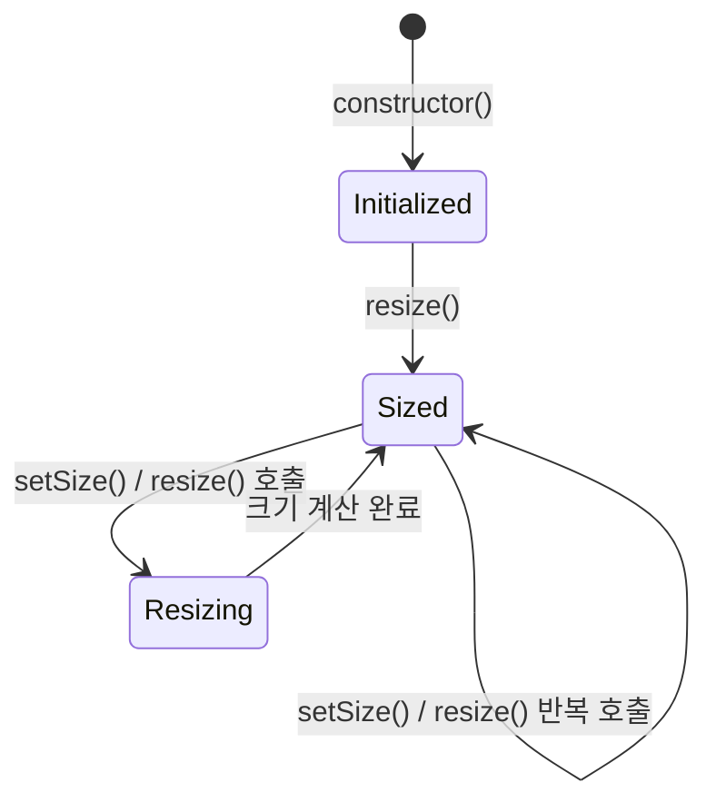

# Viewport StateChart

## Overview

Viewport는 Flicking에서 뷰포트 크기 정보를 관리하는 핵심 컴포넌트입니다. 뷰포트는 패널들이 보여지는 컨테이너 역할을 하며, 사용자에게 보여질 영역의 크기를 결정합니다.

## States

Viewport 컴포넌트는 비교적 단순한 상태를 가집니다:

1. **Initialized**: 생성자에서 초기화된 상태
2. **Resizing**: 크기 조정 중인 상태
3. **Sized**: 특정 크기로 설정된 상태

## State Transitions

## Events

Viewport는 자체적으로 이벤트를 발생시키지 않습니다. 대신 상위 Flicking 컴포넌트가 다음 이벤트를 처리합니다:
- `BEFORE_RESIZE`: 크기 조정 전에 발생
- `AFTER_RESIZE`: 크기 조정 후에 발생

## Properties

Viewport는 다음과 같은 주요 속성을 가집니다:

| 속성 | 타입 | 설명 |
|------|------|------|
| element | HTMLElement | 뷰포트 엘리먼트 |
| width | number | 패딩을 제외한 뷰포트의 너비 |
| height | number | 패딩을 제외한 뷰포트의 높이 |
| padding | object | 뷰포트의 패딩 값 (left, right, top, bottom) |

## Methods

Viewport의 주요 메서드:

| 메서드 | 파라미터 | 설명 |
|--------|----------|------|
| setSize | { width?, height? } | 뷰포트의 크기를 변경 |
| resize | - | 현재 엘리먼트 크기에 맞게 내부 상태 업데이트 |

## 뷰포트 동작 시나리오

1. **초기화**: Flicking 생성 시 Viewport 객체가 생성되고 초기화됩니다.
2. **초기 크기 설정**: 뷰포트 엘리먼트의 현재 크기를 기반으로 내부 크기 상태가 설정됩니다.
3. **동적 크기 변경**: 
   - 사용자가 명시적으로 `setSize()` 메서드를 호출하여 크기 변경
   - 윈도우 리사이즈나 레이아웃 변경으로 인한 `resize()` 호출
4. **패딩 계산**: 뷰포트의 실제 사용 가능한 영역 계산을 위한 패딩 값 업데이트

## Viewport와 다른 컴포넌트 간의 관계

- **Flicking**: Viewport를 생성하고 관리
- **Camera**: Viewport 크기 정보를 사용하여 패널 위치 계산
- **Panel**: Viewport 크기에 따라 보이는 패널 결정
- **Control**: Viewport 크기 기반으로 사용자 제스처 입력 범위 조정

## 구현 고려사항

1. **박스 모델 계산**: border-box vs content-box 스타일에 따른 크기 계산 차이 처리
2. **소수점 크기 처리**: useFractionalSize 옵션에 따라 정확한 소수점 크기 계산
3. **반응형 지원**: 문자열 기반 크기(%, vw, vh) 지원 