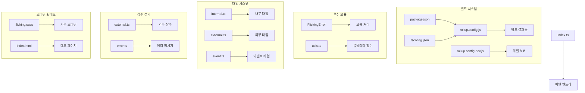
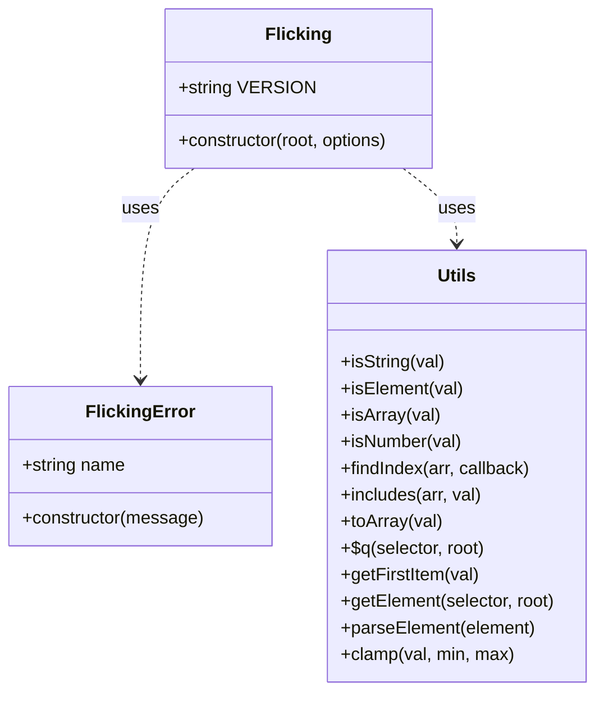

# 1단계: 기본 구조 구축

## 개요
1단계에서는 egjs-flicking 라이브러리의 기본 구조를 구축했습니다. 이 단계에서는 프로젝트 설정, 개발 환경 구성, 기본 디렉토리 구조 생성, 그리고 핵심 모듈의 기본 구현을 진행했습니다.

## 디렉토리 구조
```
scratch/
├── demo/              # 데모 페이지
│   └── index.html     # 기본 데모 HTML
├── dist/              # 빌드 결과물 (생성 예정)
├── sass/              # 스타일 파일
│   └── flicking.sass  # 기본 스타일
├── src/               # 소스 코드
│   ├── camera/        # 카메라 관련 컴포넌트 (구현 예정)
│   ├── const/         # 상수 정의
│   │   ├── error.ts   # 에러 메시지 상수
│   │   └── external.ts # 외부 사용 상수
│   ├── control/       # 컨트롤 관련 컴포넌트 (구현 예정)
│   ├── core/          # 핵심 컴포넌트
│   │   └── FlickingError.ts # 에러 클래스
│   ├── renderer/      # 렌더링 관련 컴포넌트 (구현 예정)
│   ├── type/          # 타입 정의
│   │   ├── event.ts   # 이벤트 타입
│   │   ├── external.ts # 외부 사용 타입
│   │   └── internal.ts # 내부 사용 타입
│   ├── utils.ts       # 유틸리티 함수
│   ├── index.ts       # 메인 엔트리 포인트
│   └── index.umd.ts   # UMD 빌드용 엔트리 포인트
├── package.json       # 패키지 설정
├── rollup.config.js   # Rollup 빌드 설정
├── rollup.config.dev.js # 개발 서버 설정
├── tsconfig.json      # TypeScript 설정
└── tsconfig.declaration.json # 타입 선언 파일 생성 설정
```

## 1단계에서 구현한 컴포넌트

### 프로젝트 설정
- **package.json**: 의존성 및 스크립트 정의
- **tsconfig.json**: TypeScript 컴파일러 설정
- **rollup.config.js**: 빌드 설정 (ESM, CommonJS, UMD)
- **rollup.config.dev.js**: 개발 서버 설정

### 기본 타입 정의
- **내부 타입 (internal.ts)**: 타입 유틸리티
- **외부 타입 (external.ts)**: 외부 API용 인터페이스 (ElementLike, Plugin, Status 등)
- **이벤트 타입 (event.ts)**: 이벤트 인터페이스 정의

### 상수 정의
- **외부 상수 (external.ts)**: DIRECTION, ALIGN, MOVE_TYPE, CIRCULAR_FALLBACK, EVENTS
- **에러 메시지 (error.ts)**: 오류 상수 정의

### 유틸리티 및 기본 컴포넌트
- **유틸리티 함수 (utils.ts)**: 문자열, 요소, 배열 처리 함수
- **FlickingError 클래스**: 에러 처리 구현

### 스타일 및 데모
- **기본 스타일 (flicking.sass)**: 필수 CSS 스타일
- **데모 페이지 (index.html)**: 기본 사용법 예제

## 아키텍처 다이어그램



## 클래스 다이어그램



## 1단계에서 구현한 주요 기능

1. **프로젝트 기본 구조 설정**
   - 패키지 관리 및 빌드 시스템 구축
   - TypeScript 기반 개발 환경 설정

2. **타입 시스템 구축**
   - 외부 API용 타입 정의
   - 이벤트 시스템을 위한 타입 정의

3. **상수 정의**
   - 방향, 정렬, 이동 타입 등 주요 상수 정의
   - 에러 메시지 상수화

4. **유틸리티 함수 구현**
   - DOM 조작 및 검증 함수
   - 배열 및 데이터 처리 유틸리티

5. **에러 처리 시스템**
   - 커스텀 에러 클래스 구현

6. **스타일 및 데모 기반 마련**
   - 기본 스타일 정의
   - 데모 페이지 구조 설정

## 다음 단계 계획

2단계에서는 다음 컴포넌트들을 구현할 예정입니다:

1. Viewport 클래스 구현
2. Camera 클래스 기본 구현
3. Panel 컴포넌트 구현
4. 기본 Control 클래스 구현

이러한 컴포넌트들은 Flicking의 핵심 기능을 담당하며, 슬라이더의 기본적인 동작을 구현하게 됩니다. 