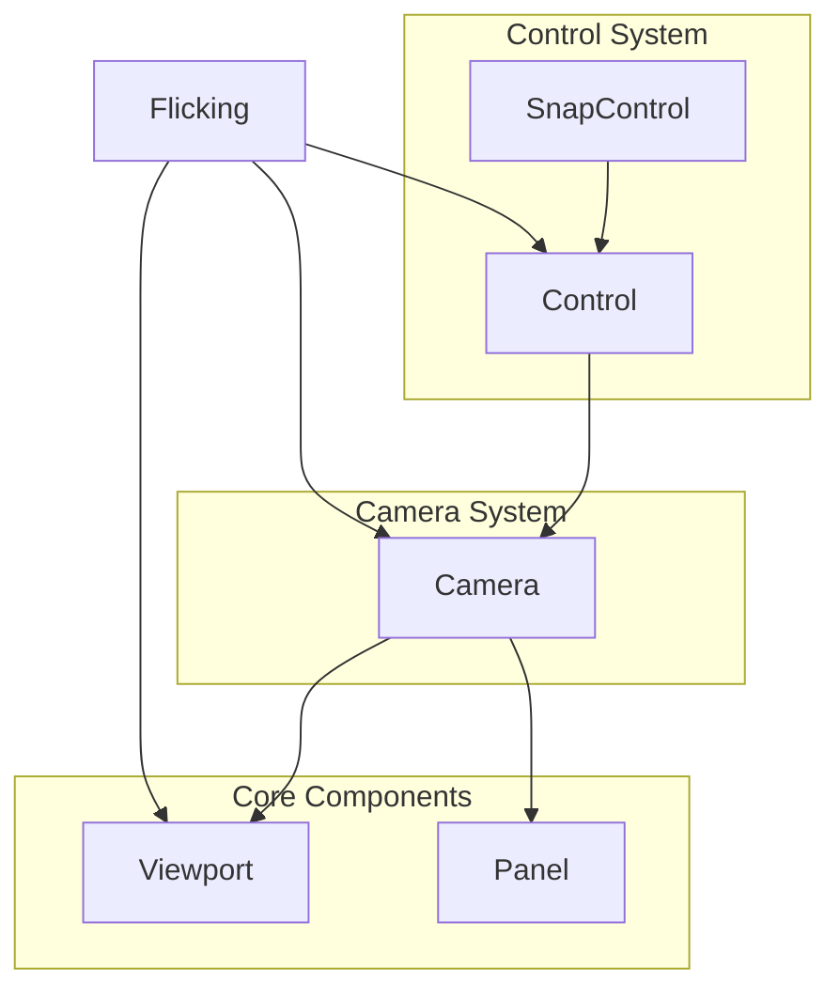
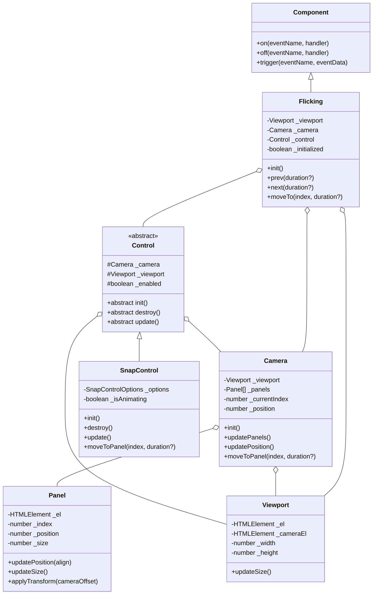

# 2단계: 핵심 컴포넌트 구현

## 개요

2단계에서는 egjs-flicking 라이브러리의 핵심 컴포넌트들을 구현했습니다. 이 단계에서는 Viewport, Panel, Camera, Control 등의 클래스를 구현하고 이들을 Flicking 클래스에 통합했습니다.

## 구현한 컴포넌트

### 1. Viewport 클래스

뷰포트 요소를 관리하는 컴포넌트입니다. 뷰포트는 패널이 보여지는 창 역할을 합니다.

```typescript
class Viewport {
  private _el: HTMLElement;        // 뷰포트 요소
  private _cameraEl: HTMLElement;  // 카메라 요소
  private _width: number;          // 뷰포트 너비
  private _height: number;         // 뷰포트 높이

  // 주요 메서드
  public updateSize(): { width: number; height: number }
  public get width(): number
  public get height(): number
  public get element(): HTMLElement
  public get cameraElement(): HTMLElement
}
```

### 2. Panel 클래스

개별 패널(슬라이드) 요소를 관리하는 컴포넌트입니다.

```typescript
class Panel {
  private _el: HTMLElement;      // 패널 요소
  private _index: number;        // 패널 인덱스
  private _position: number;     // 패널 위치
  private _size: number;         // 패널 크기
  private _align: number;        // 패널 정렬 값
  private _isHorizontal: boolean; // 가로 방향 여부

  // 주요 메서드
  public updatePosition(align: number): void
  public updateSize(): void
  public applyTransform(cameraOffset: number): void
  public get element(): HTMLElement
  public get index(): number
  public get size(): number
  public get position(): number
}
```

### 3. Camera 클래스

패널들을 관리하고 카메라 위치를 제어하는 컴포넌트입니다.

```typescript
class Camera {
  private _viewport: Viewport;     // 뷰포트 인스턴스
  private _panels: Panel[];        // 패널 배열
  private _currentIndex: number;   // 현재 활성화된 패널 인덱스
  private _position: number;       // 현재 카메라 위치
  private _targetPosition: number; // 목표 카메라 위치
  private _isHorizontal: boolean;  // 가로 방향 여부

  // 주요 메서드
  public init(): void
  public updatePanels(): void
  public updatePanelSize(): void
  public updatePanelPosition(): void
  public updatePosition(): void
  public applyTransform(): void
  public moveToPanel(index: number, duration?: number): void
  public get index(): number
  public get panels(): Panel[]
  public get currentPanel(): Panel | null
  public get position(): number
}
```

### 4. Control 클래스와 SnapControl 클래스

카메라 이동을 제어하는 추상 클래스와 그 구현체입니다.

```typescript
abstract class Control {
  protected _camera: Camera;       // 카메라 인스턴스
  protected _viewport: Viewport;   // 뷰포트 인스턴스
  protected _enabled: boolean;     // 활성화 여부

  // 추상 메서드
  public abstract init(): void;
  public abstract destroy(): void;
  public abstract update(): void;

  // 구현된 메서드
  public enable(): void
  public disable(): void
  public get enabled(): boolean
  public get camera(): Camera
}

class SnapControl extends Control {
  private _options: SnapControlOptions;
  private _isAnimating: boolean;

  // 구현된 메서드
  public init(): void
  public destroy(): void
  public update(): void
  public moveToPanel(index: number, duration?: number): void
  public get animating(): boolean
}
```

### 5. Flicking 클래스 업데이트

모든 컴포넌트를 통합하는 메인 클래스입니다.

```typescript
class Flicking extends Component<FlickingEvents> {
  public static VERSION: string;

  // 핵심 컴포넌트
  private _viewport: Viewport;
  private _camera: Camera;
  private _control: Control;
  
  // 옵션
  private _align: string | number;
  private _defaultIndex: number;
  private _horizontal: boolean;
  private _duration: number;
  private _interruptable: boolean;
  
  // 상태
  private _initialized: boolean;

  // 주요 메서드
  public init(): void
  public prev(duration?: number): void
  public next(duration?: number): void
  public moveTo(index: number, duration?: number): void
  public get index(): number
  public get currentPanel(): Panel | null
  public get panels(): Panel[]
  public get element(): HTMLElement
  public get initialized(): boolean
}
```

## 아키텍처 다이어그램



## 클래스 다이어그램



## 구현 과정에서 마주친 문제와 해결책

### 1. TypeScript 타입 문제

**문제**: `Node` 타입에 `querySelectorAll` 메서드가 없어 타입 오류 발생
```
Property 'querySelectorAll' does not exist on type 'Node'.
```

**해결책**: `Node` 타입 대신 `ParentNode` 인터페이스를 사용하도록 수정
```typescript
export const $q = (selector: string, root?: ParentNode): Array<Element> => 
  toArray((root || document).querySelectorAll(selector));
```

### 2. Component 상속 문제

**문제**: `@egjs/component`의 `Component` 클래스에서 상속받은 메서드인 `emit`이 인식되지 않는 문제
```
Property 'emit' does not exist on type 'Flicking'.
```

**해결책**: 
1. `Component` 클래스의 실제 메서드명이 `trigger`임을 확인하고 이를 사용
```typescript
this.trigger(EVENTS.READY, {});
```

2. 이벤트 리스너도 Component의 `on` 메서드를 사용하도록 수정
```typescript
flicking.on("ready", function() { ... });
```

### 3. CSS 스타일 적용 문제

**문제**: 빌드된 CSS 파일이 제대로 로드되지 않는 문제

**해결책**: 
1. CSS 파일 경로 수정
```html
<link rel="stylesheet" href="flicking.css">
```

2. JavaScript 파일 경로 수정
```html
<script src="flicking.js"></script>
```

3. 필요한 경우 빌드된 파일을 데모 디렉토리에 직접 복사
```bash
cp dist/flicking.js dist/flicking.css demo/
```

## 기능 설명

### 기본 동작 원리

1. **초기화 과정**:
   - Viewport 요소와 Camera 요소를 찾고 초기화
   - 패널 요소들을 발견하고 Panel 인스턴스 생성
   - 패널 크기와 위치 계산
   - 기본 인덱스로 카메라 위치 이동

2. **이동 메커니즘**:
   - `prev()`, `next()`, `moveTo()` 등의 메서드 호출
   - Control 인스턴스를 통해 카메라 위치 변경
   - 패널들에 CSS transform 적용하여 움직임 표현

### 구현된 기능

- 뷰포트와 카메라 컴포넌트를 통한 기본 UI 구조
- 패널 컴포넌트를 통한 개별 슬라이드 관리
- 이전/다음 슬라이드로 이동 기능
- 특정 인덱스로 이동 기능
- 기본적인 이벤트 처리 (ready 이벤트)

## 다음 단계 계획

3단계에서는 다음 기능들을 구현할 예정입니다:

1. **사용자 인터랙션 구현**
   - 드래그를 통한 슬라이더 이동
   - 터치 이벤트 처리
   - 이동 애니메이션 개선

2. **추가 기능 구현**
   - 순환(circular) 모드
   - 자유 스크롤(freeScroll) 모드
   - 더 다양한 이벤트 처리

3. **성능 최적화**
   - 가상화(virtualization) 구현
   - 렌더링 성능 개선

## 요약

2단계에서는 Flicking의 핵심 컴포넌트들을 구현하고 기본적인 슬라이더 기능을 구현했습니다. Viewport, Panel, Camera, Control 등의 클래스를 통해 모듈화된 구조를 갖추었으며, 각 컴포넌트는 단일 책임 원칙을 따라 설계되었습니다. 몇 가지 타입 문제와 컴포넌트 상속 문제를 해결하면서 기본적인 슬라이더 기능을 구현했습니다. 다음 단계에서는 사용자 인터랙션과 애니메이션 등 더 고급 기능을 구현할 예정입니다. 