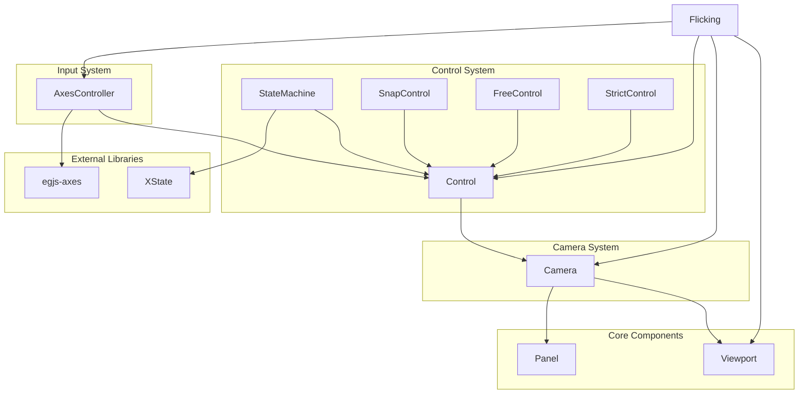
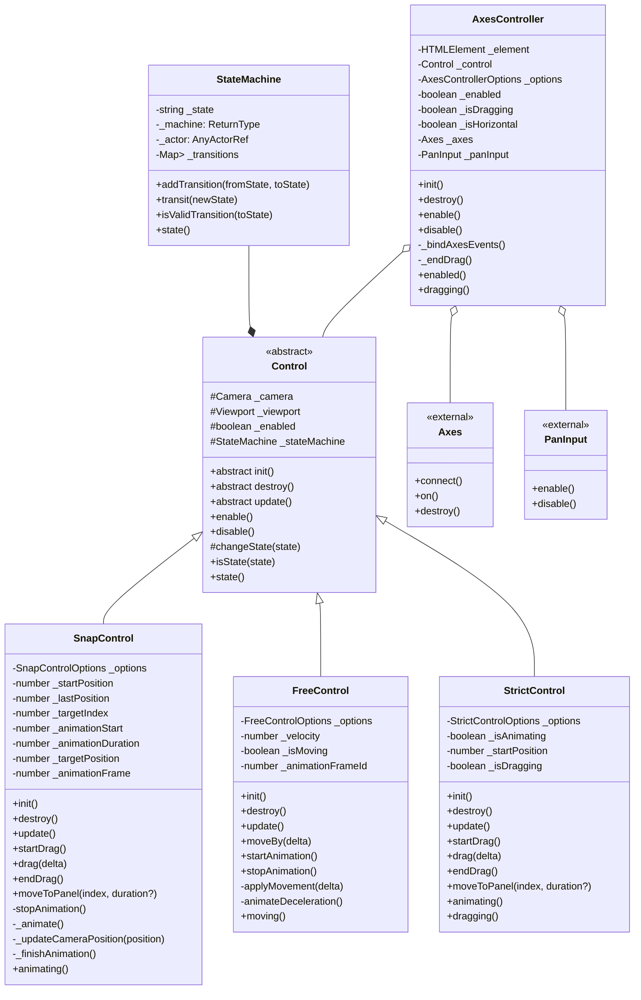

# 3단계: 동작 제어 구현

## 개요

3단계에서는 egjs-flicking 라이브러리의 동작 제어 시스템을 구현했습니다. 이 단계에서는 기존 Control 클래스를 확장하고, 새로운 Control 구현체들을 추가했으며, 사용자 입력을 처리하기 위한 AxesController를 구현했습니다. 또한 상태 관리를 위해 xstate 라이브러리를 도입하고, 사용자 입력 처리를 위해 egjs-axes 라이브러리를 활용했습니다.

## 구현한 컴포넌트

### 1. StateMachine 클래스

xstate 라이브러리를 활용한 상태 관리 시스템입니다.

```typescript
import { createMachine, createActor } from 'xstate';
import type { AnyActorRef } from 'xstate';

class StateMachine {
  private _state: string;
  private _machine: ReturnType<typeof createMachine>;
  private _actor: AnyActorRef;
  private _transitions: Map<string, Set<string>> = new Map();
  
  // 주요 메서드
  public addTransition(fromState: string, toState: string): this
  public transit(newState: string): boolean
  public isValidTransition(toState: string): boolean
  public get state(): string
}
```

### 2. 강화된 Control 클래스

상태 관리 기능이 추가된 기본 Control 추상 클래스입니다.

```typescript
enum ControlState {
  IDLE = "idle",
  HOLDING = "holding",
  DRAGGING = "dragging",
  ANIMATING = "animating"
}

abstract class Control {
  protected _camera: Camera;
  protected _viewport: Viewport;
  protected _enabled: boolean;
  protected _stateMachine: StateMachine;
  
  // 주요 메서드
  public abstract init(): void;
  public abstract destroy(): void;
  public abstract update(): void;
  public enable(): void
  public disable(): void
  protected changeState(state: ControlState): boolean
  public isState(state: ControlState): boolean
  public get state(): ControlState
}
```

### 3. 개선된 SnapControl 클래스

스냅 동작을 위한 Control 구현체로, 상태 관리와, 애니메이션 및 드래그 기능이 추가되었습니다.

```typescript
interface SnapControlOptions {
  duration: number;
  interruptable: boolean;
  threshold: number;
  easing: string;
}

class SnapControl extends Control {
  private _options: SnapControlOptions;
  private _startPosition: number;
  private _lastPosition: number;
  private _targetIndex: number;
  private _animationStart: number;
  private _animationDuration: number;
  private _targetPosition: number;
  private _animationFrame: number | null;
  
  // 주요 메서드
  public init(): void
  public destroy(): void
  public update(): void
  public startDrag(): void
  public drag(delta: number): void
  public endDrag(): void
  public moveToPanel(index: number, duration?: number): void
  private stopAnimation(): void
  private _animate(): void
  private _updateCameraPosition(position: number): void
  private _finishAnimation(): void
  public get animating(): boolean
}
```

### 4. FreeControl 클래스

자유 스크롤을 지원하는 Control 구현체입니다.

```typescript
interface FreeControlOptions {
  deceleration: boolean;
  decelerationRate: number;
}

class FreeControl extends Control {
  private _options: FreeControlOptions;
  private _velocity: number;
  private _isMoving: boolean;
  private _animationFrameId: number | null;
  
  // 주요 메서드
  public init(): void
  public destroy(): void
  public update(): void
  public moveBy(delta: number): void
  public startAnimation(): void
  public stopAnimation(): void
  private applyMovement(delta: number): void
  private animateDeceleration(): void
  public get moving(): boolean
}
```

### 5. StrictControl 클래스

엄격한 이동 제어를 제공하는 Control 구현체입니다.

```typescript
interface StrictControlOptions {
  duration: number;
  threshold: number;
}

class StrictControl extends Control {
  private _options: StrictControlOptions;
  private _isAnimating: boolean;
  private _startPosition: number;
  private _isDragging: boolean;
  
  // 주요 메서드
  public init(): void
  public destroy(): void
  public update(): void
  public startDrag(): void
  public drag(delta: number): void
  public endDrag(): void
  public moveToPanel(index: number, duration?: number): void
  public get animating(): boolean
  public get dragging(): boolean
}
```

### 6. AxesController 클래스

egjs-axes 라이브러리를 활용하여 터치와 마우스 이벤트를 처리하는 컨트롤러입니다.

```typescript
import { Control } from "../control";
import Axes from "@egjs/axes";
import { PanInput } from "@egjs/axes";

interface AxesControllerOptions {
  preventDefault: boolean;
  threshold: number;
  usePointer: boolean;
}

class AxesController {
  private _element: HTMLElement;
  private _control: Control;
  private _options: AxesControllerOptions;
  private _enabled: boolean;
  private _isDragging: boolean;
  private _isHorizontal: boolean;
  private _axes: Axes;
  private _panInput: PanInput;
  
  // 주요 메서드
  public init(): void
  public destroy(): void
  public enable(): void
  public disable(): void
  private _bindAxesEvents(): void
  private _endDrag(): void
  public get enabled(): boolean
  public get dragging(): boolean
}
```

### 7. Flicking 클래스 업데이트

새 컨트롤 시스템을 통합한 Flicking 클래스 업데이트입니다.

```typescript
enum CONTROL_MODE {
  SNAP = "snap",
  FREE = "free",
  STRICT = "strict"
}

interface FlickingOptions {
  align?: string | number;
  defaultIndex?: number;
  horizontal?: boolean;
  duration?: number;
  interruptable?: boolean;
  controlMode?: CONTROL_MODE;
  threshold?: number;
  preventDefaultOnMove?: boolean;
  deceleration?: boolean;
  decelerationRate?: number;
}

class Flicking extends Component<FlickingEvents> {
  private _viewport: Viewport;
  private _camera: Camera;
  private _control: Control;
  private _axesController: AxesController | null;
  
  // 주요 기능
  public init(): void
  public prev(duration?: number): void
  public next(duration?: number): void
  public moveTo(index: number, duration?: number): void
  private _createControl(): Control
  private _initAxesController(): void
  public destroy(): void
}
```

## 아키텍처 다이어그램



## 클래스 다이어그램



## 구현 과정에서 마주친 문제와 해결책

### 1. 복잡한 상태 관리

**문제**: 드래그 시작, 드래그 중, 애니메이션 중 등 다양한 상태를 관리하는 것이 복잡했습니다.

**해결책**: xstate 라이브러리를 활용한 StateMachine 클래스를 구현하여 상태 전이를 명확하게 관리하고, 잘못된 상태 전환을 방지했습니다. xstate의 공식적인 상태 관리 패턴을 활용하여 유지보수성을 향상시켰습니다.

### 2. 이벤트 정규화

**문제**: 터치 이벤트와 마우스 이벤트의 처리 방식이 달라 일관된 인터페이스가 필요했습니다.

**해결책**: egjs-axes 라이브러리를 도입하여 다양한 입력 이벤트를 일관된 방식으로 처리할 수 있게 했습니다. egjs-axes는 터치, 마우스, 포인터 이벤트를 자동으로 정규화하여 처리해줍니다.

### 3. 다양한 Control 타입 동적 처리

**문제**: Flicking 클래스에서 다양한 Control 타입을 유연하게 처리해야 했습니다.

**해결책**: Control 생성을 팩토리 메서드(_createControl)로 추상화하고, 메서드 검사를 통해 적절한 기능을 사용하도록 구현했습니다.

### 4. 애니메이션 이동 제어

**문제**: 애니메이션 방식으로 카메라를 부드럽게 이동시키는 로직이 복잡했습니다.

**해결책**: SnapControl에서 requestAnimationFrame을 사용한 애니메이션 루프와 easing 함수를 구현하여 부드러운 이동 효과를 구현했습니다.

### 5. 이벤트 타입 일관성

**문제**: 다양한 이벤트 타입에 필요한 속성들을 일관성 있게 관리해야 했습니다.

**해결책**: 이벤트 인터페이스를 확장하여 각 이벤트 타입에 필요한 속성을 명확하게 정의하고, 이를 Flicking 클래스에서 일관되게 사용하도록 했습니다.

### 6. 이벤트 비동기 처리

**문제**: 컴포넌트 초기화 시점과 이벤트 발생 시점의 동기화가 맞지 않아 이벤트 리스너가 제대로 작동하지 않는 문제가 발생했습니다.

**해결책**: 
1. `Flicking.init()` 메서드를 Promise를 반환하는 비동기 메서드로 변경했습니다.
2. 이벤트 발생을 setTimeout을 통해 현재 실행 컨텍스트가 완료된 후에 처리되도록 수정했습니다.
3. Flicking 클래스에 EVENTS 상수를 정적 프로퍼티로 추가하여 외부에서 쉽게 접근할 수 있도록 했습니다.

```typescript
// Promise를 반환하는 init 메서드
public init(): Promise<void> {
  if (this._initialized) return Promise.resolve();
  
  // 초기화 로직...
  
  this._initialized = true;
  
  // 비동기적으로 이벤트 발생
  return new Promise<void>(resolve => {
    setTimeout(() => {
      this.trigger(EVENTS.READY, {});
      resolve();
    }, 0);
  });
}

// 생성자에서 비동기 초기화 처리
constructor(element, options) {
  // ...
  
  // 비동기 초기화 (Promise를 무시하기 위해 void 사용)
  void this.init();
}

// 이벤트 상수를 정적 프로퍼티로 노출
public static EVENTS = EVENTS;
```

### 7. 외부 라이브러리 의존성 관리

**문제**: 상태 관리를 위해 xstate 라이브러리를 도입하고, 입력 처리를 위해 egjs-axes 라이브러리를 도입하면서 기존 코드와의 호환성을 유지해야 했습니다.

**해결책**: 
1. StateMachine 클래스의 공개 API는 유지하면서 내부 구현만 xstate로 대체했습니다.
2. AxesController 클래스의 공개 API도 유지하면서 내부 구현을 egjs-axes로 대체했습니다.
3. 이를 통해 기존 코드를 변경하지 않고도 강력한 외부 라이브러리의 기능을 활용할 수 있게 되었습니다.

## 기능 설명

### 상태 관리 시스템

Control 컴포넌트는 다음 상태를 가질 수 있습니다:

- **IDLE**: 아무 조작이 없는 대기 상태
- **HOLDING**: 사용자가 터치/마우스를 누르고 있는 상태
- **DRAGGING**: 사용자가 드래그하고 있는 상태
- **ANIMATING**: 애니메이션이 진행 중인 상태

StateMachine은 xstate 라이브러리를 활용하여 이러한 상태 간의 전환을 관리하며, 허용되지 않은 상태 전환을 방지합니다. xstate의 기능을 활용하여 다음과 같은 이점을 얻었습니다:

- 선언적 상태 정의
- 상태 전이 검증
- 상태 변화에 따른 이벤트 발생

### 입력 처리 시스템

AxesController는 egjs-axes 라이브러리를 활용하여 다음과 같은 입력 처리를 지원합니다:

1. **다양한 입력 장치 지원**: 터치, 마우스, 포인터 이벤트를 일관된 방식으로 처리
2. **이벤트 정규화**: 다양한 브라우저와 장치에서 일관된 입력 처리
3. **자동 감속 및 애니메이션**: 관성 스크롤과 같은 자연스러운 움직임 제공
4. **다중 축 지원**: 수평 및 수직 이동을 동시에 처리 가능
5. **설정 가능한 임계값**: 드래그 감지를 위한 임계값 조정 가능

### 제어 모드

Flicking은 다음 세 가지 제어 모드를 지원합니다:

1. **SNAP**: 패널 간 스냅 동작, 드래그 후 가장 가까운 패널로 자동 이동
2. **FREE**: 자유 스크롤링, 관성 스크롤 지원
3. **STRICT**: 인접 패널로만 이동 가능한 엄격한 제어

### 애니메이션 시스템

SnapControl은 다음과 같은 애니메이션 기능을 제공합니다:

1. **이징 함수**: 부드러운 이동을 위한 easeOutCubic 이징 함수
2. **부드러운 감속**: 드래그 후 자연스러운 감속 효과
3. **애니메이션 진행률 계산**: 시간 기반의 애니메이션 진행률 계산
4. **애니메이션 중단 처리**: 진행 중인 애니메이션을 중단하고 새로운 이동 시작

## 다음 단계 계획

4단계에서는 다음 기능들을 구현할 예정입니다:

1. **렌더링 시스템 구현**
   - 기본 Renderer 클래스 구현
   - VanillaRenderer 구현
   - 렌더링 전략(일반/가상) 구현

2. **애니메이션 개선**
   - 더 다양한 이징 함수 구현
   - 애니메이션 매니저 구현

3. **이벤트 시스템 강화**
   - 더 다양한 이벤트 지원 (이동 세부 단계별 이벤트)
   - 이벤트 버블링 및 캡처링 처리

## 요약

3단계에서는 Flicking의 컨트롤 시스템을 강화하고 다양한 제어 모드를 구현했습니다. xstate 라이브러리를 활용한 StateMachine을 통한 상태 관리와 egjs-axes 라이브러리를 활용한 입력 처리를 구현하여 강력하고 유연한 시스템을 구축했습니다. 다양한 Control 구현체(SnapControl, FreeControl, StrictControl)를 통해 사용자 요구에 맞는 다양한 상호작용 모드를 지원합니다. 특히 SnapControl은 부드러운 애니메이션 기능을 갖추도록 개선되었으며, 이를 통해 다양한 사용자 인터랙션을 지원하는 유연한 슬라이더 기능을 구현할 수 있게 되었습니다. 